# yuzuWeightEditor

  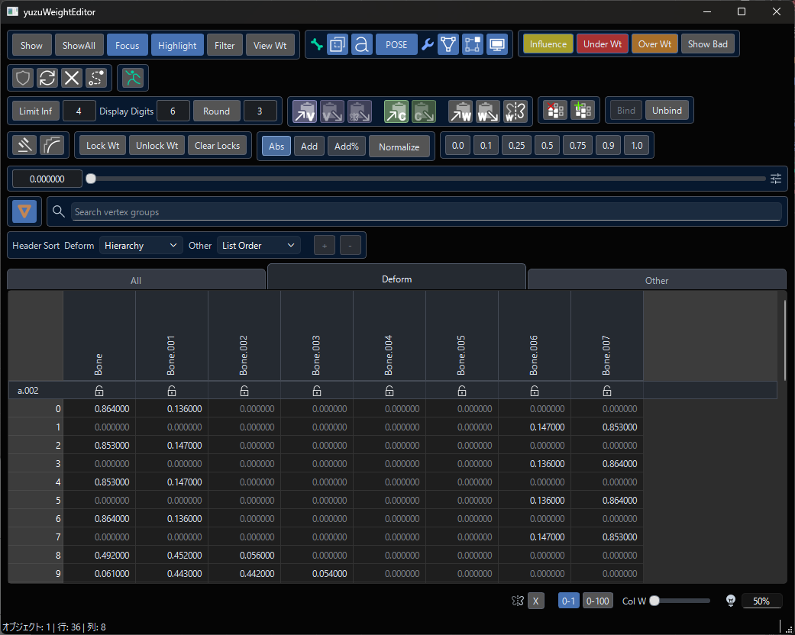

[[日本語 README](./README.md)]

yuzuWeightEditor is a Blender add-on for viewing and editing weights in a spreadsheet-like interface.  
Inspired by Maya's SiWeightEditor, it brings vertex group inspection, numeric editing, copy/paste tools, symmetry workflows, and binding helpers into a single editor window.

Note: The screenshots and GIFs in this README show the Japanese UI, but the released add-on also supports an English UI.

## What It Does

- View and edit vertex-group weights in a spreadsheet-style layout
- Switch between selected-only display, full display, and viewport-linked display
- Sync selection with the 3D viewport and highlight selected vertices
- Detect invalid weights
- Round weights, normalize values, and limit the maximum influence count
- Copy and paste by cell, vertex, or object
- Apply symmetry workflows to weights
- Delete unused vertex groups and add missing bone vertex groups
- Assist with bone collection visibility, armature display, modifier display, and weight display

## Requirements

- Blender 4.2 LTS
- Blender 5.0

This add-on does not run purely inside Blender's standard UI. It opens a separate editor window built with `PySide6`.  
If `PySide6` is not installed yet, you can install it from the add-on panel using `Install PySide6`.

## Installation

### 1. Install the Add-on

- Install it from `Preferences > Add-ons > Install from Disk`.

### 2. Enable the Add-on

Enable `yuzuWeightEditor` in `Edit > Preferences > Add-ons`.

### 3. Install PySide6

  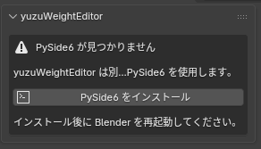

If Blender shows `PySide6 not found`, follow these steps from the 3D View sidebar:

1. Open `View3D > Sidebar (N) > yuzuWeight`
2. Click `Install PySide6`
3. Restart Blender after the installation finishes

## How to Launch

1. Open `View3D > Sidebar (N) > yuzuWeight`
2. Click `Open Editor`
3. Work with the relevant mesh, and select vertices when needed

## Quick Start

1. Select the mesh whose weights you want to edit.
2. Open the editor with `Open Editor`.
3. Select mesh objects or vertices so they appear in the sheet.
4. Edit cells directly, or adjust values using the slider and input fields at the bottom.
5. Use `Normalize`, `Round`, and `Limit Inf` as needed.
6. Use `Show Bad` when you want to isolate only problematic vertices.

## Main UI / Tools

### Spreadsheet

  

- Tabs: Vertex groups are separated into `All`, `Deform`, and `Other`.
- Header: Displays vertex groups. You can right-click to rename a vertex group. Renaming a `Deform` group also renames the corresponding bone.
- Vertex Group Lock: Click the icon to lock a vertex group.
- Cells: Edit weight values directly here.
- Numeric Input: Right-click a selected cell, or select it and type a number key to start numeric input. When multiple cells are selected, the same value is applied to all of them.
- Copy/Paste Menu: Press `Shift` or `Ctrl + Right Click` to open the copy/paste menu, where you can use `VC / VP / MP / CC / CP`.

### Display Controls

  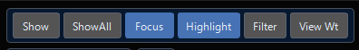

- `Show`: Display selected vertices only.
- `ShowAll`: Display all vertices of the selected object.
- `Focus`: Sync viewport selection and sheet display.
- `Highlight`: Highlight vertices selected in the sheet inside the 3D viewport.
- `View Wt`: Keep weight display visible in Edit Mode.

  

### Bone / Modifier Display

  

- Show armature in front
- Show bone names
- Toggle `POSE / REST`
- Toggle cage display
- Toggle Edit Mode display
- Toggle modifier display
- Show bone collections

### Invalid Weight Detection

  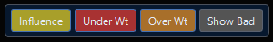

- `Influence`: Check how many bones affect a vertex.
- `Under Wt`: Check for insufficient total weight.
- `Over Wt`: Check for excessive total weight.
- `Show Bad`: Show only problematic vertices.

  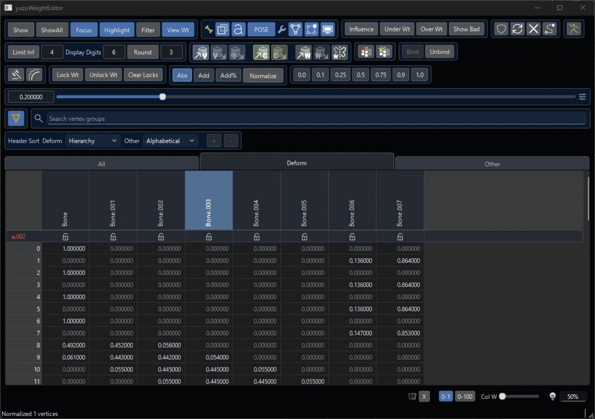

### Spreadsheet Editing / Bone Collection Display

  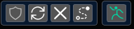

- Sheet Update Lock: Lock updates to the displayed vertices in the sheet.
- Force Refresh: Refresh the sheet manually. This is mainly useful while update lock is enabled.
- Clear: Clear the current sheet display.
- `Select`: Reflect the current sheet selection in the viewport. Hold `Shift` to add to the current vertex selection.
- Bone Collection Display: Adjust bone collection visibility directly from the editor.

  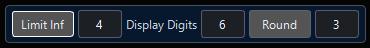

- `Display Digit`: Set how many decimal places are shown.
- `Round`: Round weights to the chosen number of decimal places using the spin box.
- `Limit Inf`: Limit the number of influences. Set the limit in the spin box. `0` means unlimited. If no cells are selected, the operation targets the entire sheet.

### Copy / Mirror / Transfer

  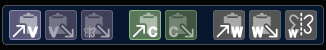

- `VC / VP`: Copy and paste on a per-vertex basis. Vertex-group locks and cell locks are ignored when pasting.
- `MP`: Mirror-paste the contents of `VC` based on the symmetry naming dictionary.

  

- `CC / CP`: Copy and paste on a per-cell basis. Locked vertex groups and locked cells are skipped when pasting.

  

- `WC / WP`: Transfer weights between selected mesh objects.

  

- `WS`: Apply weight symmetry. `Right Click` opens the symmetry naming dictionary.

  

`Symmetry Naming Dictionary`

  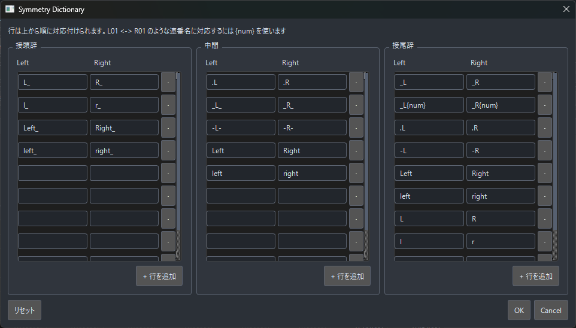

### Vertex Groups / Binding

  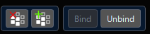

- Delete Unused Vertex Groups: Deletes vertex groups whose weight is `0` on every vertex.
- Add Missing Vertex Groups: Adds missing vertex groups in one click when a related armature has bones but the corresponding vertex groups do not exist.
- `Bind`: Available when one armature and one or more mesh objects are selected.
- `Unbind`: Removes the armature modifier from mesh objects and also clears armature parenting if it exists.

### Weight Hammer / Weight Smooth

  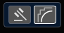

This is an experimental feature.

- Weight Hammer: Adjusts the weights of vertices selected in the sheet to better match surrounding weights. Useful when only a few vertices have incorrect weights.
- Weight Smooth: Smooths the weights of vertices selected in the sheet. `Right Click` opens its settings.

  

### Cell Locks

  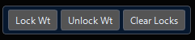

- `Lock Wt`: Lock selected cells so they cannot be edited in the editor.
- `Unlock Wt`: Unlock selected cells.
- `Clear Locks`: Clear cell locks for the selected object.

### Numeric Editing

  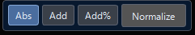

- Absolute Input: Replace cell values with the slider value.
- Additive Input: Add or subtract the slider value from the current cell values.
- Percentage Additive Input: Add a percentage of the current value. For example, if the weight is `0.5` and the slider is `0.5`, then `0.25` is added, resulting in `0.75`.
- `Normalize`: Auto-normalize toggle. When enabled, edits in the editor are automatically normalized. `Right Click` forces normalization for the target range. If no cells are selected, it targets the entire sheet.

### Preset Buttons

  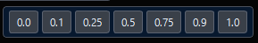

- `0.0~1.0`: Quickly enter commonly used values. Click to replace, `Shift` to add, and `Ctrl` to subtract.

### Active Sort / Vertex Group Search

  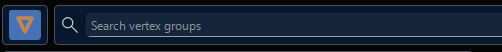

- Active Sort: When multiple objects are selected, show the active object at the top of the sheet.
- Vertex Group Search: Search by vertex group name. When `Filter` is enabled and some vertex groups are hidden, you can toggle their visibility. Clicking a vertex group name jumps to that group's position in the sheet.

### Vertex Group Sort

  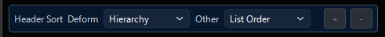

- Set the display order of vertex-group columns. `Deform` and `Other` can each be configured separately.
- `Hierarchy (Deform)`: Sort deform vertex groups by hierarchy.
- `Alphabetical`: Sort vertex groups alphabetically.
- `List`: Sort vertex groups according to Blender's list order.

#### Reordering Vertex Groups

You can reorder vertex groups only when vertex-group sorting is set to `List`. The result is also reflected back into Blender. Middle-click a header to select it, then middle-drag to reorder it.

  

### Bottom UI

  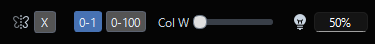

- Toggle Mirror Editing: Toggle mirror editing in Edit Mode. When enabled, vertices on the opposite side of the selected vertices are also shown, and editing one side affects the other side.
- `0-1 / 0-100` Display Toggle: Switch between displaying weights in the `0~1.0` range or the `0~100` range.
- `Col W`: Adjust column width.
- Zero-Weight Brightness: Adjust the brightness of `0` weights.

### Preferences

  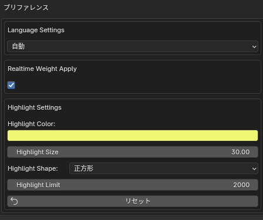

These settings are configured in Blender's preferences.

- `Language Settings`: When set to automatic, some editor text such as descriptions and error messages follows Blender's language setting. You can also switch it manually.
- `Realtime Weight Apply`: Controls whether slider-based weight edits are applied in real time. Disable it if the editor feels heavy.
- `Highlight Settings`: Settings for viewport highlights.
- `Highlight Color`: Set the highlight color.
- `Highlight Size`: Set the highlight size.
- `Highlight Shape`: Set the highlight shape.
- `Highlight Limit`: Set the maximum number of highlight markers shown.
