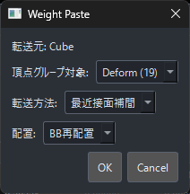
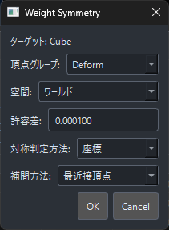
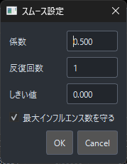

# yuzuWeightEditor

  

[[English README](./README.en.md)]

yuzuWeightEditor は、Blender 上でウェイトをスプレッドシート感覚で確認・編集するためのアドオンです。  
Maya の SiWeightEditor に着想を得て、頂点グループの確認、数値編集、コピー&ペースト、左右対称処理、バインド補助までを 1 つのエディターにまとめています。

## できること

- 頂点グループのウェイトを表計算ソフトのように一覧表示して、そのまま編集
- 選択頂点のみ表示、全表示、ビューポート選択との連動表示の切り替え
- 3D ビューポートとの選択同期とハイライト表示
- 不正ウェイトの検出
- ウェイトの丸め、正規化、最大 Influence 数の調整
- セル単位 / 頂点単位 / オブジェクト単位のコピー&ペースト
- メッシュ間のウェイト転送（トポロジー / 最近接など複数の方式に対応）
- ウェイトのシンメトリー化（空間・対称判定方式・頂点グループ範囲の指定に対応）
- ウェイトのハンマー / スムースによる補修（試験的機能）
- 未使用頂点グループの削除、不足しているボーン用頂点グループの追加
- ボーンコレクション表示、アーマチュア表示、モディファイア表示、ウェイト表示の補助

## 動作環境

- Blender 4.2 LTS
- Blender 5.0

このアドオンは Blender 標準の UI だけで完結するのではなく、`PySide6` を使った別ウィンドウのエディターを開いて動作します。  
`PySide6` が未導入の場合は、アドオンパネルから `Install PySide6` を実行してインストールできます。

## インストール

### 1. アドオンを配置

- プリファレンス > アドオン > ディスクからインストール でインストールしてください。

### 2. アドオンを有効化

Blender の `Edit > Preferences > Add-ons` で `yuzuWeightEditor` を有効にします。

### 3. PySide6 を導入

  

`PySide6 not found` と表示された場合は、3D ビューのサイドバーから次の手順を実行してください。

1. `View3D > Sidebar (N) > yuzuWeight`
2. `Install PySide6`
3. インストール完了後、Blender を再起動

## 起動方法

1. `View3D > Sidebar (N) > yuzuWeight` を開く
2. `Open Weight Editor` を押す（エディターを開いている間はボタンが `Close Weight Editor` に変わり、もう一度押すと閉じられます）
3. 必要に応じてメッシュや頂点を選択した状態で作業する

## クイックスタート

1. ウェイトを編集したいメッシュを選択します。
2. `Open Weight Editor` でエディターを開きます。
3. メッシュオブジェクト、または頂点を選択してシートに表示します。
4. セルを直接編集するか、下部のスライダーや入力欄で値を調整します。
5. 必要に応じて `Normalize`、`Round`、`Limit Inf` を使って整えます。
6. 問題のある頂点だけを確認したいときは `Show Bad` を使います。

## 主な UI / ツール

### スプレッドシート

  

- タブ : 頂点グループの種類によって All、Deform、Other で分かれています。
- ヘッダー : 頂点グループが表示されます。右クリックで頂点グループのリネームが行え、Deform 頂点グループは対応するボーン名もリネームされます。
- 頂点グループロック : アイコンをクリックすることで頂点グループロックをかけられます。
- セル : ここを操作することでウェイト値を編集します。
  - 数値入力 : 選択したセルを右クリック、または選択して数字キー入力でウェイト値入力に入ります。複数選択時は選択セルすべてに同じ数値が入ります。
  - 算術入力 : 入力を `+` `-` `*` `/` で始めると、現在のウェイト値に対して加算・減算・乗算・除算を行います。例えば `+0.1` で現在値に `0.1` を加算、`*0.5` で半分にします。
  - コピペメニュー : Shift、または Ctrl + 右クリックでコピペメニューが開きます。`VC / VP / MP / CC / CP` が選択できます。
- パン : シート上を `中ボタン`ドラッグ、または `Alt + 中ボタン`ドラッグで表示をスクロール（パン）できます。

### 表示まわり

  

- `Show` : 選択頂点だけを表示します。
- `ShowAll` : 選択オブジェクトの頂点をすべて表示します。
- `Focus` : ビューポート選択とシート表示を同期します。
- `Highlight` : シート上で選択した頂点を 3D ビューポートで強調表示します。
- `View Wt` : 編集モード中もウェイトの表示を行います。

  

### ボーン / モディファイア表示

  

- アーマチュア前面表示
- ボーン名表示
- `POSE / REST` 切り替え
- ケージ表示切り替え
- 編集モード表示切り替え
- モディファイア表示切り替え
- ボーンコレクション表示

### 不正ウェイト検出

  

- `Influence` : 影響しているボーン数をチェック
- `Under Wt` : 合計ウェイト不足をチェック
- `Over Wt` : 合計ウェイト超過をチェック
- `Show Bad` : 問題のある頂点だけを抽出表示

  

### スプレッドシート編集 / ボーンコレクション表示

  

- シート更新ロック : シートの表示頂点の更新をロックします。
- 強制更新 : シートを更新します。主にロック中の更新を想定しています。
- クリア : シートの表示をクリアします。
- `Select` : ツールでシート上の選択をビューポートへ反映します。Shift で現在の選択頂点へ追加選択できます。
- ボーンコレクション表示 : ボーンコレクションの表示設定をエディター上で行えます。

  

- `Display Digit` : 小数点以下を何桁表示するかの設定です。
- `Round` : 丸め処理を行います。スピンボックスで小数第何位までで丸めるかを設定します。
- `Limit Inf` : インフルエンス数の制限を行います。スピンボックスで制限数を設定します。`0` で無制限になります。選択セルがない場合は全体が対象です。

### コピペ / ミラー / 転送

  

- `VC / VP` : 頂点単位のコピー&ペーストを行います。頂点グループロック、セルロックは無視されてペーストされます。
- `MP` : 反転命名辞書に基づいて `VC` の内容を反転ペーストします。

  

- `CC / CP` : セル単位のコピー&ペーストを行います。頂点グループロック、セルロックはスキップしてペーストします。

  

- `WC / WP` : 選択メッシュ間のウェイト転送を行います。`WC` で転送元メッシュを登録し、`WP` で転送先メッシュへペーストします。

  

`WP` を押すと転送ダイアログが開き、転送のしかたを細かく指定できます。

  

- 頂点グループ対象 : 転送する頂点グループの範囲を `すべて / Deform / Other / 単一` から選びます。`単一` のときは対象の頂点グループを 1 つ指定します。
- 転送方法 : ウェイトの対応付け方法を選びます。`トポロジー / 最近接頂点 / 最近接辺頂点 / 最近接辺補間 / 最近接面頂点 / 最近接面補間 / 投影面補間` に対応しています。
- 配置 : 転送前のオブジェクト位置の合わせ方を `ワールド`（そのままの位置）/ `BB再配置`（バウンディングボックス基準で再配置）から選びます。`BB再配置` 時は基準を `オブジェクトBB / 選択BB` から選べます。
- 対象オブジェクトに別のアーマチュアモディファイアがある場合は、競合の解決方法（`アーマチュアを置き換える` / `頂点グループのみ`）を確認するダイアログが表示されます。

- `WS` : ウェイトのシンメトリー化を行います。`右クリック`で`反転命名辞書`を開きます。

  

`WS` を押すと Weight Symmetry ダイアログが開き、対称化の条件を指定できます。ミラー方向は選択中の頂点から自動判定されます。

  

- 空間 : 対称判定に使う座標空間を `ワールド / アーマチュア / ローカル / オブジェクト` から選びます。
- 頂点グループ : 対称化する頂点グループの範囲を `All / Deform / Other / Active`（アクティブグループのみ）から選びます。`Other` は左右反転せず、同名グループ内で対称化します。
- 対称判定方法 : 左右頂点の対応付けを `座標 / トポロジー` から選びます。座標判定では `許容差` で誤差を調整できます。
- 補完方法 / 補間方法 : ペアにならなかった頂点を、最近接などの方式で座標ベースに補完・補間して埋めます。
- 対象オブジェクトに別のアーマチュアモディファイアがある場合は、競合の解決方法（`アーマチュアを上書き` / `ミラーのみ`）を確認するダイアログが表示されます。

`反転命名辞書`

  

- 左右の名前の対応ルールを `接頭辞 / 中間 / 接尾辞` に分けて定義します。各行で `Left` と `Right` のパターンを設定し、行は上から順に対応付けられます。
- `L01 <-> R01` のような連番名には `{num}` を使います。
- `+ 行を追加` でルールを追加、`リセット` で標準の左右辞書に戻します。

### 頂点グループ / バインド

  

- 未使用頂点グループ削除 : 全ての頂点でウェイト 0 の頂点グループを削除します。`右クリック`では、開いているタブに関わらず全ての頂点グループを対象に処理します。
- 不足頂点グループ追加 : 関連アーマチュアにはボーンが存在するが、頂点グループが存在しない場合にワンボタンで追加します。
- `Bind` : 1 つのアーマチュアと 1 つ以上のメッシュオブジェクトを選択して使用可能になります。選択メッシュを自動ウェイトでアーマチュアにバインドします（オブジェクトモードでのみ使用できます）。
- `Unbind` : メッシュオブジェクトのアーマチュアモディファイアを削除し、親にアーマチュアがあれば関係も切ります。

### ウェイトハンマー / ウェイトスムース

  

試験的機能です。

- ウェイトハンマー : シートで選択している頂点のウェイトを周囲に合わせて修正します。一部頂点のウェイトがおかしい時に有効です。
- ウェイトスムース : シートで選択している頂点のウェイトにスムースをかけます。`右クリック`で設定が開けます。

  

ウェイトスムースの `右クリック` で開く設定ダイアログでは、次の項目を調整できます。

  

- `Factor`（係数） : 各反復で近傍平均との差へどれだけ寄せるかを設定します。
- `Repeat`（反復回数） : スムース処理を繰り返す回数を設定します。
- `Threshold`（しきい値） : 近傍平均との差がこの値未満の頂点は、その反復で更新しません。
- `Obey Max Influences`（最大インフルエンス数を守る） : 有効にすると、スムース後に `Limit Inf` の設定を deform ウェイトへ適用します。

> ※ ハンマー / スムースは All・Deform タブでのみ使用できます。

### セルロック

  

- `Lock Wt` : 選択セルをロックし、エディター上で編集不可にします。
- `Unlock Wt` : 選択セルのロックを解除します。
- `Clear Locks` : 選択オブジェクトのセルロックを解除します。

### 数値編集

  

- 絶対値入力 : スライダーの値をセルに置き換えます。
- 加算入力 : セルの値にスライダーの値を加算 / 減算します。
- 率加算入力 : セルの値から率加算します。ウェイトが `0.5` でスライダーが `0.5` なら、`0.25` が加算されて `0.75` になります。
- `Normalize` : 自動正規化ボタンです。Trueでエディター上の編集に対して自動で正規化が行われます。`右クリック`で対象を強制的に正規化します。選択セルがない場合は全体が対象になります。

### プリセットボタン

  

- `0.0~1.0` : よく使う数値を一発で入れられます。クリックで置き換え、`Shift` で加算、`Ctrl` で減算します。

### アクティブソート / 頂点グループ検索

  

- アクティブソート : 複数オブジェクト選択時、アクティブオブジェクトをシートの一番上に表示します。
- 頂点グループ検索 : 頂点グループ名で検索できます。`Filter` オンで非表示頂点グループがある際は表示切り替えが行えます。頂点グループ名をクリックすると、シート上の頂点グループの位置まで移動します。

### 頂点グループソート

  

- 頂点グループ列の表示順を設定します。`Deform`、`Other` それぞれで設定できます。
  - `Hierarchy (Deform)` : ヒエラルキー順に頂点グループをソートします。
  - `Alphabetical` : アルファベット順に頂点グループをソートします。
  - `List` : Blender 上のリスト順に頂点グループをソートします。
- 中央のヘッダーソート設定からは、ソート方法の切り替えに加えて `Other` 頂点グループの追加・削除も行えます。追加・削除は `All` または `Other` タブで `Other` 頂点グループがアクティブなときに使用できます。

#### 頂点グループ並べ替え

頂点グループソートが `List` の場合のみ、頂点グループの並べ替えが行えます。並べ替え結果は Blender 側にも反映されます。中ボタンクリックでヘッダーを選択し、そのまま中ボタンドラッグで並べ替えを行います。

> ※ ヘッダー上では中ボタンドラッグが並べ替えに使われるため、その状態でシートをパンしたい場合は `Alt + 中ボタン`ドラッグを使ってください。

  

### 下部UI

  

- ミラー編集切り替え : 編集モードでのミラー編集を切り替えます。オンだと選択頂点の反対側にある頂点も表示し、片方の編集がもう片方に反映されます。
- `0-1 / 0-100` 表示切り替え : ウェイトを `0～1.0` の範囲で表示するか、`0～100` の範囲で表示するかを切り替えます。
- `V/H` : 頂点グループ名（ヘッダー）の表示方向を切り替えます。オンにすると頂点グループ名を横向きに表示し、列幅を自動的に広げます。
- `Col W` : 列幅を設定できます（1.0x〜2.5x）。
- 0 ウェイト明るさ調整 : 0 ウェイトの明るさを設定します。

### プリファレンス

  

Blender のプリファレンス上で行う設定です。

- `Language Settings` : 自動にすると Blender の言語設定に合わせてエディター上の説明文やエラーメッセージなど一部言語が変更されます。手動で切り替えることも可能です。
- `Realtime Weight Apply` : スライダーでウェイトを変更する際にリアルタイムでウェイト反映されるかの設定です。重い場合はオフにしてください。
- `Highlight Settings` : ハイライトの設定です。
  - `Highlight Color` : ハイライトの色を設定します。
  - `Highlight Size` : ハイライトの大きさを設定します。
  - `Highlight Shape` : ハイライトの形を設定します。
  - `Highlight Limit` : ハイライトの表示数上限を設定します。
